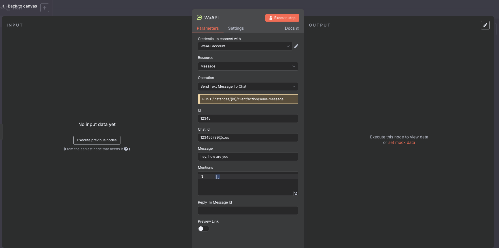

# @waapiapp/n8n-nodes-waapi

<p align="center">
  
  
</p>

Automate your
[**WaAPI**](https://www.waapi.app/)
workflows with
[**n8n**](https://n8n.io/)
!



[](https://www.npmjs.com/package/@waapiapp/n8n-nodes-waapi)

- GitHub: [waapiapp/n8n-nodes-waapi](https://github.com/WaAPIapp/n8n-nodes-waapi)
- npm: [@waapiapp/n8n-nodes-waapi](https://github.com/WaAPIapp/n8n-nodes-waapi)
- WaAPI API reference: [http://waapi.app/docs](http://waapi.app/docs)
- 👉 Generated from
  [WAAPI OpenAPI](https://waapi.app/api/swagger.json)
  using
  [**devlikeapro/n8n-openapi-node**](https://github.com/devlikeapro/n8n-openapi-node)

# Tables of Contents

<!-- toc -->

- [Installation](#installation)
- [Usage](#usage)
  * [Credentials](#credentials)
    + [Platform](#platform)
    + [User](#user)
    + [Inbox](#inbox)
- [Development](#development)
- [Support the project](#support-the-project)

<!-- tocstop -->

# Installation
Install [the community node package in your n8n instance](https://docs.n8n.io/integrations/community-nodes/installation/gui-install/):
```
@waapiapp/n8n-nodes-waapi
```

# Usage
1. Install the community package to your n8n instance.
2. Add **WaAPI API** **credentials** in **n8n**.
3. Create a new workflow with the **WaAPI API** node.

## Credentials
To authenticate with WaAPI, you'll need an access token which can be obtained from your WaAPI account settings at [https://waapi.app/user/api-tokens](https://waapi.app/user/api-tokens).

Once you have your access token, you can create WaAPI credentials in n8n to start using the node.

# Development
The node is generated from the
[WaAPI OpenAPI](https://waapi.app/api/swagger.json)
using
[**devlikeapro/n8n-openapi-node**](https://github.com/devlikeapro/n8n-openapi-node).

Likely the fix should be done in the OpenAPI specification file or in the generator itself.
