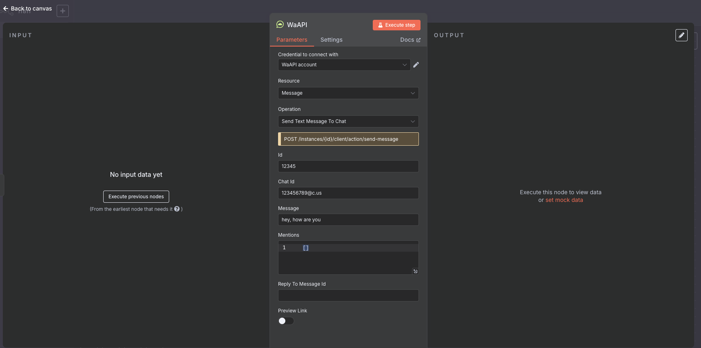

# @waapiapp/n8n-nodes-waapi

<p align="center">
  
  
</p>

Automate your
[**WaAPI**](https://www.waapi.app/)
workflows with
[**n8n**](https://n8n.io/)
!



[](https://www.npmjs.com/package/@waapiapp/n8n-nodes-waapi)

- GitHub: [waapiapp/n8n-nodes-waapi](https://github.com/WaAPIapp/n8n-nodes-waapi)
- npm: [@waapiapp/n8n-nodes-waapi](https://www.npmjs.com/package/@waapiapp/n8n-nodes-waapi)
- WaAPI API reference: [https://waapi.app/docs](https://waapi.app/docs)
- 👉 Generated from the
  [WaAPI OpenAPI spec](https://waapi.app/api/swagger.json)
  using
  [**devlikeapro/n8n-openapi-node**](https://github.com/devlikeapro/n8n-openapi-node)

# Table of Contents

<!-- toc -->

- [Installation](#installation)
- [Credentials](#credentials)
- [Usage](#usage)
  * [How the node is organised](#how-the-node-is-organised)
  * [Example 1: Send a text message](#example-1-send-a-text-message)
  * [Example 2: List your instances](#example-2-list-your-instances)
  * [Example 3: Receive incoming messages](#example-3-receive-incoming-messages)
  * [Example 4: Create a group](#example-4-create-a-group)
  * [Chat ID formats](#chat-id-formats)
  * [Reading the response](#reading-the-response)
- [Development](#development)
- [License](#license)

<!-- tocstop -->

# Installation

Install the package as a
[community node in your n8n instance](https://docs.n8n.io/integrations/community-nodes/installation/gui-install/):

```
@waapiapp/n8n-nodes-waapi
```

After installation the node appears in the nodes panel as **WaAPI**.

# Credentials

1. Create an API token in your WaAPI account under
   [https://waapi.app/user/api-tokens](https://waapi.app/user/api-tokens).
2. In n8n open **Credentials → Add credential**, pick **WaAPI API** and paste
   the token.

Every WaAPI node in your workflows selects one of these credentials. The token
is sent as a Bearer token to `https://waapi.app/api/v1`.

# Usage

## How the node is organised

Each WaAPI node performs one API call. You pick a **Resource** (what you act
on) and an **Operation** (what you do with it); the node then shows the fields
that call needs.

| Resource | Typical operations |
|---|---|
| Instances | List Instances, Create Instance, Retrieve Instance, Update Instance, Delete Instance |
| Client | Client Status Of Instance, Retrieve Basic Client Information, Reboot, Set Status |
| Message | Send Text Message To Chat, Send Media Message, Send Location, Send Vcard, Fetch Messages, Download Media |
| Chat | Get Chats, Get Chat By Id, Archive Chat, Mute Chat, Send Seen, Send Typing, … |
| Contact | Get Contacts, Get Contact By Id, Block Contact, Get Profile Pic Url, … |
| Number | Get Number Id, Get Country Code |
| Group | Create Group, Add Group Participant, Promote Group Participant, Update Group Settings, … |
| Channel | Get Channels, Create Channel, Subscribe To Channel, … |
| Community | Create Community, Get Communities, Link Community Subgroup, … |
| Label | Get Labels, Change Chat Labels, … |
| Story | Post Status, Get Stories, Set Status Privacy, … |
| Webhooks | Create Webhook Subscription, List Webhook Subscriptions, Delete Webhook Subscription |

Almost every operation needs the **Id** of the instance it should run on. You
find the instance ID on the instance's page in your WaAPI dashboard, or by
running **Instances → List Instances** (Example 2).

## Example 1: Send a text message

Send a message to a single contact when something happens in your workflow.

1. Add a **WaAPI** node and select your credentials.
2. Set **Resource** to `Message` and **Operation** to `Send Text Message To Chat`.
3. Fill in the fields:

   | Field | Value | Notes |
   |---|---|---|
   | Id | `1234` | Your instance ID |
   | Chat Id | `4915112345678@c.us` | Country code + number, no `+`, no spaces, followed by `@c.us` |
   | Message | `Hi {{ $json.firstName }}, your order {{ $json.orderId }} has shipped.` | Expressions from previous nodes work as everywhere in n8n |

4. Execute the node. The instance must be connected (**Client → Client Status
   Of Instance** reports `clientStatus.instanceStatus` = `ready`), otherwise
   the API answers with an error describing the current state.

Optional fields on the same operation:

- **Reply To Message Id** quotes an earlier message.
- **Mentions** takes a JSON array of chat IDs and only applies in group chats.
- **Preview Link** toggles link previews (on by default).
- **Firedandforget** makes the call return immediately with a request ID
  instead of waiting for the send to complete.

To send an image, PDF or audio instead, choose **Send Media Message** and
provide either **Media Url** (a publicly reachable URL) or **Media Base 64**
together with **Media Name**.

## Example 2: List your instances

Useful as the first node of a workflow that fans out to several accounts, or to
look up an instance ID.

1. Add a **WaAPI** node.
2. Set **Resource** to `Instances` and **Operation** to `List Instances`.
3. Leave **Filter** empty, or enter part of an instance name or ID to narrow the
   result.

The output is one item with an `instances` array. To process each instance on
its own, follow the node with a **Split Out** node on the `instances` field.
Each entry carries `id`, `name`, `webhook_url` and `webhook_events`; `id` is
what the **Id** field of every other operation expects. The connection state
of one instance comes from **Client → Client Status Of Instance**.

## Example 3: Receive incoming messages

Incoming events are delivered to a URL you register with the instance. In n8n
that URL is a **Webhook** trigger node.

1. Add a **Webhook** trigger node, set **HTTP Method** to `POST`, and copy its
   **Production URL**.
2. In a separate one-off workflow add a **WaAPI** node with **Resource**
   `Webhooks` and **Operation** `Create Webhook Subscription`:

   | Field | Value |
   |---|---|
   | Id | your instance ID |
   | Url | the Production URL from step 1 |
   | Events | `["message"]` |
   | Source | `n8n` |

3. Execute it once. The subscription stays active until you remove it with
   **Delete Webhook Subscription**; **List Webhook Subscriptions** shows what
   is registered.
4. Activate the workflow from step 1. Every incoming message now arrives as an
   item on the Webhook node with the sender in `body.data.message.from` and
   the text in `body.data.message.body`.

Other event names accepted in **Events** include `message_create` (also fires
for messages you send), `message_ack` (delivery and read receipts), `qr`,
`ready` and `disconnected`. The full list is in the
[API reference](https://waapi.app/docs).

A typical reply bot is therefore: **Webhook** → **IF** (`{{ $json.body.data.message.fromMe }}` is false) → **WaAPI: Send Text Message To Chat** with **Chat Id** set to `{{ $json.body.data.message.from }}`.

## Example 4: Create a group

1. Add a **WaAPI** node with **Resource** `Group` and **Operation**
   `Create Group`.
2. Fill in:

   | Field | Value |
   |---|---|
   | Id | your instance ID |
   | Group Name | `Project Alpha` |
   | Group Participants | `["4915112345678@c.us", "447700900123@c.us"]` |

3. Execute the node. The response contains the new group's chat ID
   (`…@g.us`), which you can pass on to **Add Group Participant**,
   **Update Group Settings** or **Send Text Message To Chat**.

## Chat ID formats

| Target | Format | Example |
|---|---|---|
| Single contact | `<countrycode><number>@c.us` | `4915112345678@c.us` |
| Group | `<groupid>@g.us` | `120363012345678901@g.us` |
| Channel | `<channelid>@newsletter` | `120363012345678901@newsletter` |

If you only have a phone number and are not sure it is registered, run
**Number → Get Number Id** first; it returns the exact chat ID to use.

## Reading the response

Action operations (everything under Message, Chat, Group, …) return an
envelope:

```json
{
  "status": "success",
  "data": {
    "status": "success",
    "data": { "...": "the result of the action" }
  }
}
```

The outer `status` only says that the request reached your instance. Whether
the action itself succeeded is in `data.status`; on failure `data.message` and
`data.explanation` say why. Use `{{ $json.data.status }}` in an **IF** node
when you need to branch on the outcome.

# Development

The node is generated from the
[WaAPI OpenAPI spec](https://waapi.app/api/swagger.json)
using
[**devlikeapro/n8n-openapi-node**](https://github.com/devlikeapro/n8n-openapi-node).
Operations, fields and descriptions come from the spec; fixes belong there or
in the generator, not in hand-written node code.

```bash
npm install
npm run build     # regenerates nodes/WaAPI/properties.json from the spec, compiles, copies icons
npm run lint
npm test
```

# License

[MIT](LICENSE.md)
